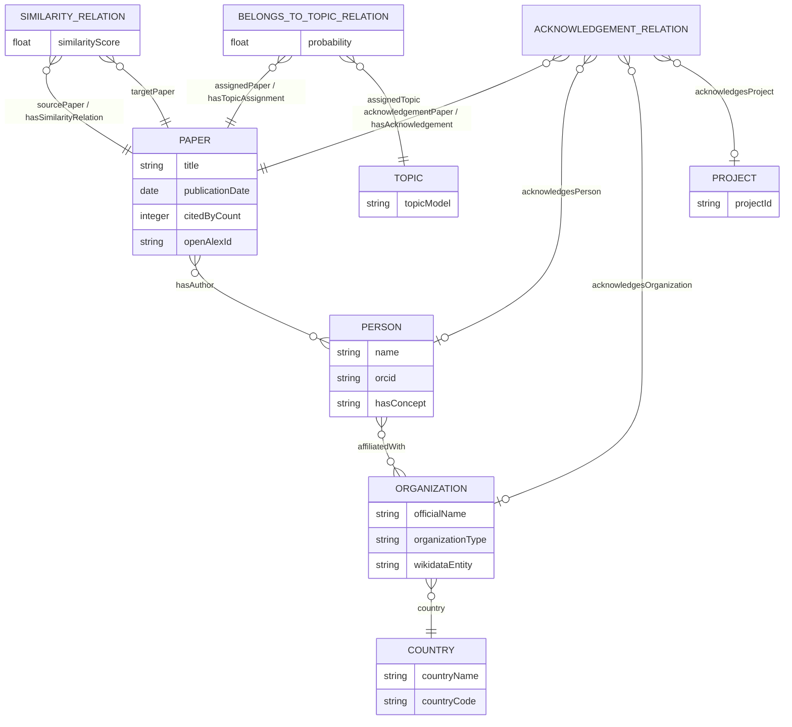

# Aplicación

La aplicación se usa para visualizar un mapa de la investigación global (de los papers analizados). Su objetivo principal es visualizar las conexiones de organizaciones, proyectos, autores y áreas de investigación a través de distintos países. Esta aplicación permite visualizar un mapa geográfico para analizar la colaboración internacional, identificar las temáticas de investigación en regiones específicas y establecer relaciones de similitud entre las investigaciones desarrolladas por distintas organizaciones o naciones.
# Knowledge Graphs

**Wikidata (RDF)** Para el contexto de organizaciones
- Organization type wdt:P31 (tipo de la organización)
- Official name wdt:P1448 (nombre de la organización)
- country wdt:P17 (país de la organización)
- country_code (código de identificación de país)
**OpenAlex/SemOpenAlex** Para información de los autores 
- cited_by_count (relevancia del paper)
- concept (para obtener de qué trata un paper)
- publication_date 
- autor_name
- orcid del autor
- institution (instituciones a las que pertenecía el autor)
- country_code (obtener país de la institución)
# Flujo de trabajo

1. El sistema recibe un identificador de publicación inicial (arxivID), el cual se usa para obtener el   artículo en OpenAlex.

2. De OpenAlex se extrae el número de citas, los conceptos clave del abstract y el listado de autores junto con sus respectivos identificadores ORCID, además se obtiene la información sobre las organizaciones a las que pertenece un autor (organización y país).

3. Las entidades reconocidas en el documento (instituciones, universidades o agencias financiadoras) se buscan en Wikidata para recuperar su tipo de organización, nombre oficial y país.

4. Todos estos datos se integran en un grafo local.
# Diagrama E/R

