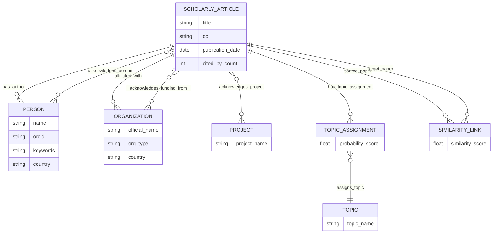

# Aplicación y Grafo de Conocimiento

## Casos de Uso

El objetivo de este Knowledge Graph es descubrir los flujos de financiación y las redes de colaboración en la investigación.
**Caso de uso principal:** Permitir a un investigador o institución identificar rápidamente qué agencias (gubernamentales o privadas) están financiando los proyectos más relevantes de una temática concreta (topics), y visualizar mediante un mapa qué países y organizaciones lideran dichas temáticas. Esto facilita la búsqueda de futuros socios estratégicos o fuentes de financiación.

## Reutilización de Vocabularios Estándar (Extensión de clases)

Para el modelado de los datos, hemos extendido vocabularios estándar de la Web Semántica:

- **Paper:** `schema:ScholarlyArticle` / `fabio:ResearchPaper`
- **Person (Author):** `foaf:Person` / `schema:Person`
- **Organization:** `org:Organization` / `schema:Organization`
- **Project:** `foaf:Project` / `schema:ResearchProject`
- **Topic:** `skos:Concept`

## Flujo de trabajo

1. El sistema recibe un identificador de publicación inicial (arxivID) para obtener el DOI del artículo.
2. Utilizando el DOI, se consulta la API de OpenAlex para extraer citas, conceptos y el listado de autores con ORCID.
3. Se itera sobre los ORCID para extraer el país del investigador y su área de trabajo.
4. **Hugging Face (IA):** Se procesan los _Abstracts_ para generar Tópicos (con probabilidad) y Similitud entre papers (con threshold) usando Modelos de Lenguaje.
5. **Hugging Face (NER):** Se procesa la sección _Acknowledgements_ con Grobid para extraer Organizaciones, Personas y Proyectos involucrados en la financiación.
6. Se enriquece la información de organizaciones con Wikidata.
7. Los datos se integran en un grafo RDF (Apache Jena Fuseki) utilizando clases n-arias para relaciones complejas.

## Diagrama

