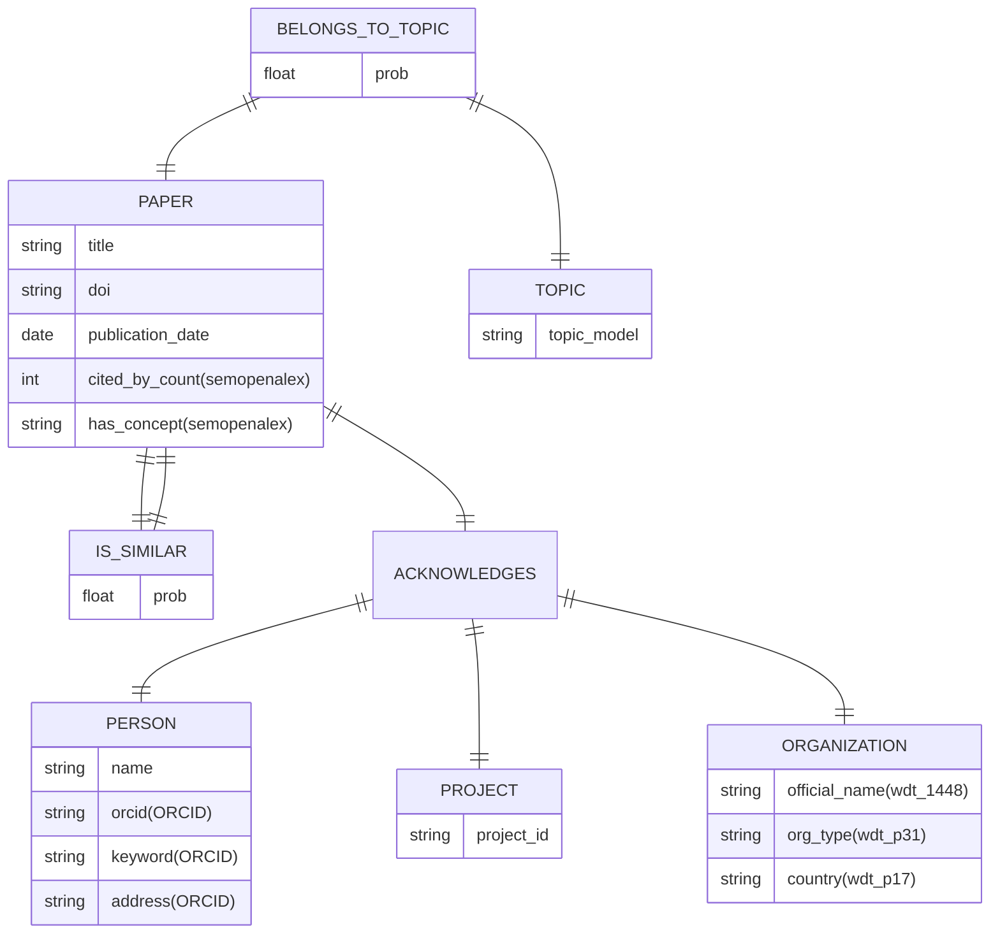

# Aplicación

## Casos de Uso

La aplicación se usa para visualizar un mapa de la investigación global (de los papers analizados). Su objetivo principal es visualizar las conexiones de organizaciones, proyectos, autores y áreas de investigación a través de distintos países. Esta aplicación permite visualizar un mapa geográfico para analizar la colaboración internacional, identificar las temáticas de investigación en regiones específicas y establecer relaciones de similitud entre las investigaciones desarrolladas por distintas organizaciones o naciones.

## Knowledge Graphs

**Wikidata (RDF)** Para el contexto de organizaciones
- Organization type wdt:P31 (tipo de la organización)
- Official name wdt:P1448 (nombre de la organización)
- country wdt:P17 (país de la organización)
**ORCID (API)** Para los autores
- keywords (especialización del investigador)
- address (país del investigador)
**OpenAlex/SemOpenAlex** Para información de los papers y orcid
- orcid (para obtener datos en ORCID)
- cited_by_count (relevancia del paper)
- has_concept (para obtener de qué trata un paper)

# Flujo de trabajo

1. El sistema recibe un identificador de publicación inicial (arxivID), el cual se usa para obtener el DOI del artículo.

2. Utilizando el DOI, se consulta la API de OpenAlex para extraer el número de citas, los conceptos clave del abstract y el listado de autores junto con sus respectivos identificadores ORCID.

3. Se itera sobre los ORCID usando la API de ORCID para extraer el país del investigador y su área de trabajo.

4. Las entidades reconocidas en el documento (instituciones, universidades o agencias financiadoras) se buscan en Wikidata para recuperar su tipo de organización, nombre oficial y país.

5. Todos estos datos se integran en un grafo local.
  
## Diagrama

