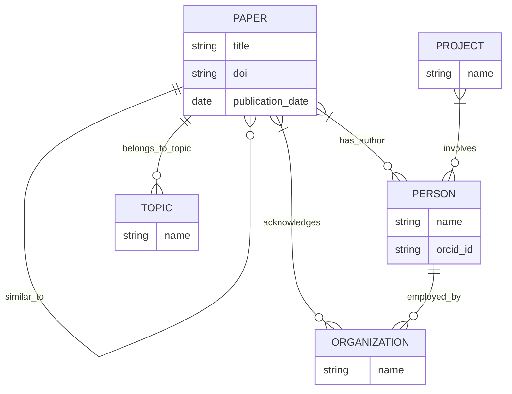

# Aplicación

# Casos de Uso

Descripción: Esta aplicación permite la búsqueda de documentos a partir de una "Persona". El objetivo es poder encontrar diferentes papers de un investigador a partir de un identificador único, permitiendonos además de listar sus papers, también encontrar sus afiliaciones y recurrencias en sus papers.

Flujo: Se recupera el nombre e id del autor, se obtienen a partir de eso más papers asociados al autor a partir de las propiedades (obtenidas en wikidata) y finalmente con las APIs encontramos la lista de papers del autor.

# Knowledge Graphs

**Wikidata (RDF)** para las publicaciones
- Q5246046 (academic publishing) para obtener información del paper
- P921 (main subject) para obtener el topic del paper
- P463 (member of) para obtener proyectos al que pertenece una persona

**ORCID (API)** para los autores
- credit-name (para obtener nombre del autor) ?
- works (para obtener lista de papers del autor)
- employment (para obtener la organización para la que trabaja) ?
# Diagrama

