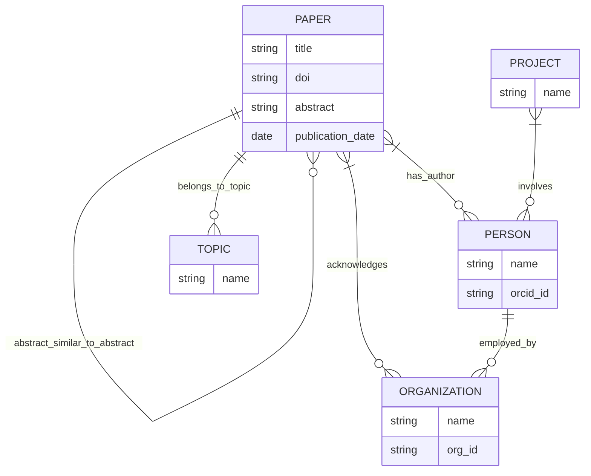

# Aplicación

# Casos de Uso

Descripción: Esta aplicación permite la búsqueda de documentos a partir de una "Persona". El objetivo es poder encontrar diferentes papers de un investigador a partir de un identificador único, permitiendonos además de listar sus papers, también encontrar sus afiliaciones y recurrencias en sus papers.

Flujo: Se recupera el nombre e id del autor, se obtienen a partir de eso más papers asociados al autor a partir de las propiedades (obtenidas en wikidata) y finalmente con las APIs encontramos la lista de papers del autor.

# Knowledge Graphs

**Wikidata (RDF)** para las publicaciones
- **Academic Publishing** (_Q5246046_) Nos permite extraer la información del paper asegurando que sea un paper cientifico.
- **Main Subject** (_P921_) Nos permite obtener el "Topic" del paper en cuestion.
- **member of** (_P463_) Nos permite obtener los datos relacionados de una persona con la organización a la que pertenece.

**ORCID (API)** para los autores
- **Nombre del autor** (credit-name) Nos permite obtener el nombre del autor y el que ha usado para sus investigaciones.
- **Listado Papers** (works) Nos permite obtener el listado de papers asociados a nuestro autor.
- **Empleo** (employment) Nos permite saber información sobre la institucion que pertence y así poder usar (P463) para seguir obteniendo papers.
- **Similitud abstracts** (abstract) Nos permite obtener una puntuación de parecidos entre papers.
  
# Diagrama

