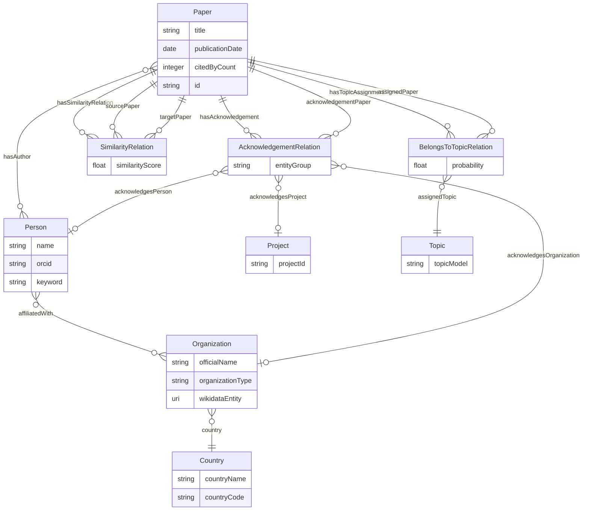

# Documentación de la Ontología: Global Research Mapping

## 🎯 Aplicación y Casos de Uso

La aplicación se utiliza para visualizar un mapa interactivo de la investigación global a partir de los artículos científicos analizados. El objetivo principal es descubrir los flujos de financiación, las temáticas emergentes y las redes de colaboración internacional en la investigación.

- **Caso de uso principal:** Permitir a investigadores, instituciones o agencias evaluadoras identificar rápidamente qué organismos (gubernamentales o privados) están financiando los proyectos más relevantes en una temática concreta (_topics_), y visualizar qué países y organizaciones lideran dichas líneas de investigación. Esto facilita de manera directa la búsqueda de socios estratégicos y la identificación de futuras fuentes de financiación.

---

## 📚 Ontología extendida

Para generar el grafo de conocimiento local, se ha diseñado una ontología que incluye las siguientes clases y propiedades:

- **Paper**: Representa un artículo científico. Propiedades: `title`, `publicationDate`, `citedByCount`, `id` (arxiv u openalex).
- **Person**: Representa a un autor. Propiedades: `name`, `orcid`, `keyword` (tópico de investigación).
- **Organization**: Representa una institución. Propiedades: `officialName`, `organizationType`, `wikidataEntity` (URI de Wikidata).
- **Country**: Representa un país. Propiedades: `countryName`, `countryCode`.
- **Project**: Representa un proyecto de investigación. Propiedades: `projectId`.
- **Topic**: Representa un tema de investigación. Propiedades: `topicModel`.

---

## ⚙️ Flujo de Trabajo del Pipeline

1. **Ingesta:** El sistema recibe un identificador de publicación inicial (como un arXiv ID o el procesamiento directo del PDF con Grobid) para aislar los metadatos estructurales básicos.
2. **Enriquecimiento Semántico:** Utilizando consultas estructuradas a las APIs de **OpenAlex**, se recupera el número de citas globales (`citedByCount`), fechas de publicación y el listado completo de autores junto con sus respectivos identificadores normalizados **ORCID**.
3. **Contextualización Institucional:** Se itera sobre las afiliaciones de los autores y se realizan consultas a la API de **Wikidata** para obtener las URIs oficiales de las organizaciones, el tipo de organización (`wdt:P31`) y el país de origen.
4. **Procesamiento de Texto con IA (Hugging Face):** Se analizan los _Abstracts_ de los artículos mediante un modelo de lenguaje para realizar clasificación _Zero-Shot_, asignando tópicos conceptuales con una puntuación de probabilidad.
5. **Reconocimiento de Entidades Financieras (NER):** Se procesa el texto de la sección de agradecimientos (_Acknowledgements_) mediante un modelo Transformer especializado en extracción de entidades para identificar de forma automatizada personas, proyectos y organizaciones financiadoras.
6. **Análisis de Similitud:** Se generan vectores de características (_embeddings_) de los textos para calcular la similitud semántica cruzada entre los artículos del dataset bajo un umbral (_threshold_) determinado.
7. **Persistencia:** Todos los datos resultantes se estructuran e inyectan en el Triple Store de **Apache Jena Fuseki** utilizando clases n-arias para modelar relaciones complejas.

---

## 📊 Diagrama Conceptual (Modelo de Datos)

El siguiente diagrama en formato Mermaid describe la estructura formal de la ontología, reflejando de manera estricta el uso de **Relaciones N-Arias** para soportar propiedades con valores ponderados (puntuaciones de similitud y porcentajes de probabilidad) y relaciones ternarias en los agradecimientos:

